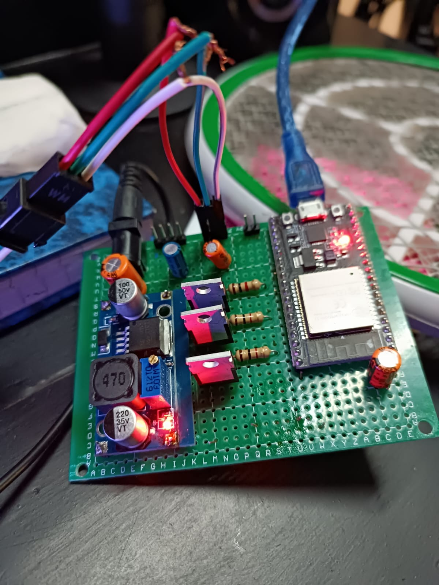

# WLED Smart RGB Controller (ESP32)

A hand-built ESP32 lighting controller that drives **~400 addressable WS2812B LEDs** running the [WLED](https://github.com/Aircoookie/WLED) firmware — plus a custom hardware extension that lets the *same board* also control non-addressable RGB strips. Wi-Fi / app control, and PC screen-sync via SignalRGB.

Solo project.

---



## What it does

- Drives **~400 addressable WS2812B LEDs** from an ESP32-WROOM running WLED firmware.
- **Wi-Fi and mobile-app control** of effects, colour, and brightness (WLED's built-in interface).
- **Ambient / screen-sync lighting** driven from a PC over **SignalRGB**.
- **One controller, two LED types:** an added MOSFET stage lets the same board also drive **non-addressable 12 V RGB strips**.

## The custom bit (the interesting part)

WLED handles addressable strips out of the box. To make one controller also drive **analog (non-addressable) RGB** strips, I added a MOSFET output stage: three **IRLZ44N** logic-level N-channel MOSFETs, one per colour channel, PWM-switched from the ESP32. Common-anode strip to +12 V; each colour's cathode line switched to ground through its MOSFET. This means a single box handles both addressable and analog strips.

```
ESP32 ──► data ──────────────► WS2812B addressable strip (~400 LEDs)
      └─► 3× PWM ─► IRLZ44N ──► 12 V analog RGB strip (R/G/B channels)
```

## Build gallery

| | |
|---|---|
| Pre-solder layout | `docs/images/build_presolder_1.jpeg`, `build_presolder_2.jpeg` |
| Finished soldered board | `docs/images/build_soldered.jpeg` |
| Installed / ambient setup | `docs/images/ambient_setup.jpeg` |

**Demos** in [`docs/video/`](docs/video/): `demo_signalrgb_ambient.mp4` (PC screen-sync) and `demo_ambient_light.mp4`.

## Hardware

- ESP32-WROOM dev board
- ~400× WS2812B addressable LEDs
- 3× IRLZ44N logic-level MOSFETs (analog-strip stage)
- 5 V supply for WS2812B, 12 V for analog strip, common ground
- Hand-soldered on protoboard

## Firmware

Runs stock **WLED** (flash via the [WLED web installer](https://install.wled.me/)). The addressable strip is configured in WLED's LED settings; the analog channels are mapped to the ESP32 PWM pins feeding the MOSFET gates. SignalRGB provides the PC-side screen-capture → LED sync.

## Notes

This is primarily a **hardware / integration** project — the firmware is open-source WLED, and the engineering here is the build, the power design, and the MOSFET extension that unifies two LED types under one controller.
