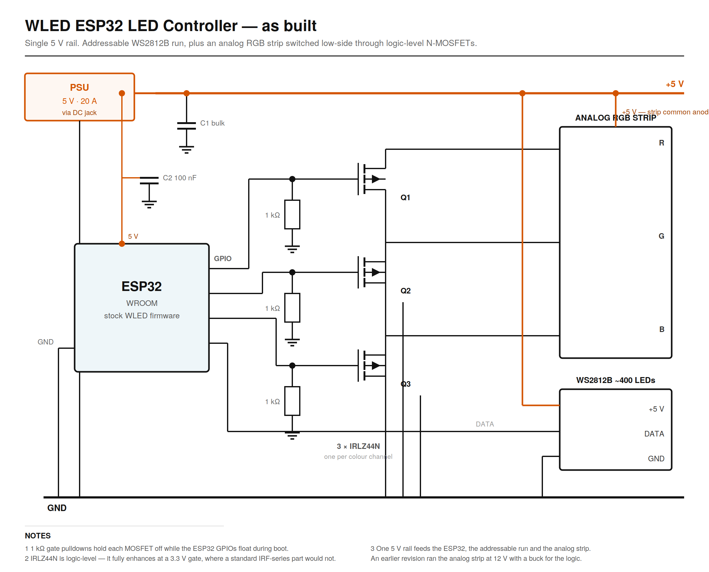
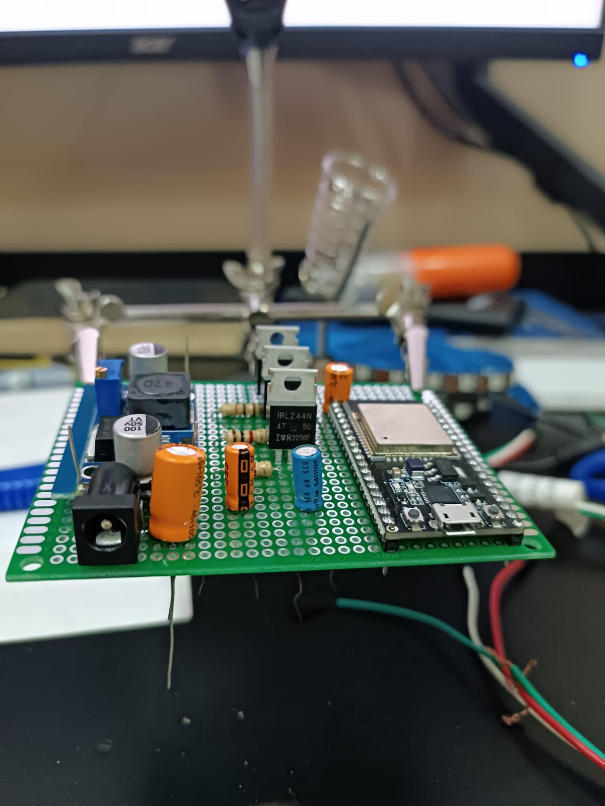
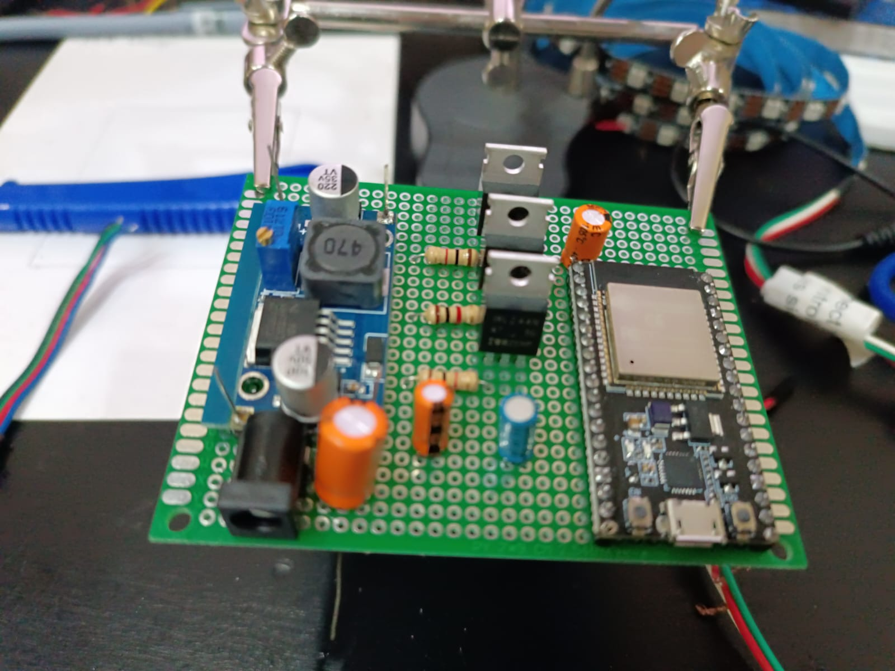
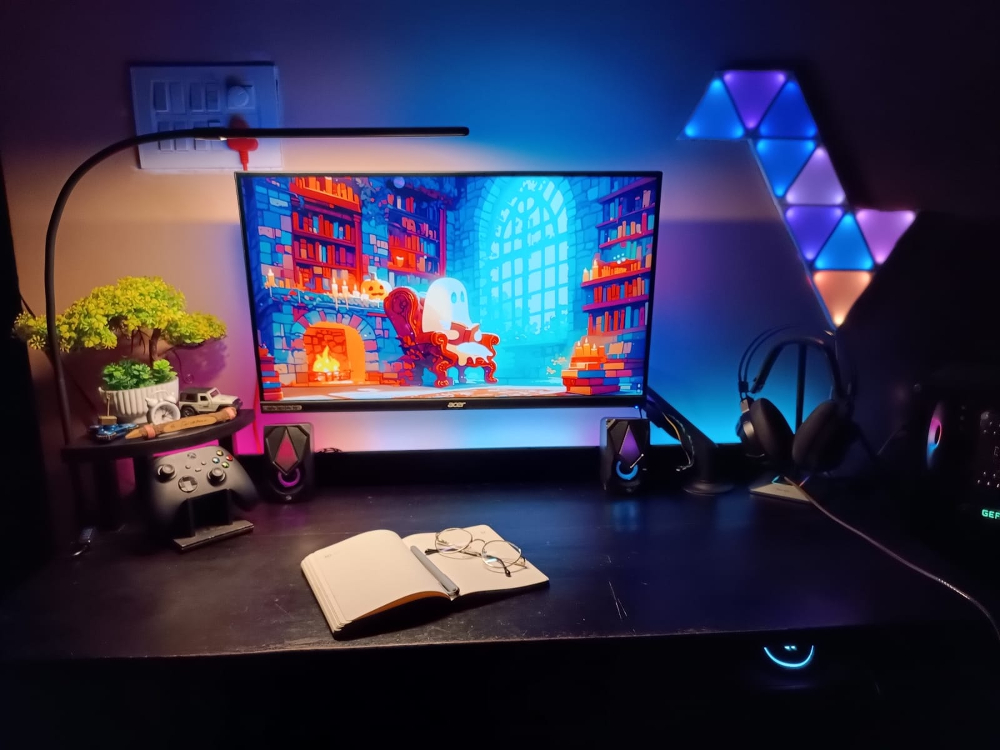

# WLED ESP32 LED Controller

A hand-built ESP32 controller driving **~400 addressable WS2812B LEDs** under
[WLED](https://github.com/Aircoookie/WLED), extended with a MOSFET output stage so the same board
also drives **analog (non-addressable) RGB strips**. Wi-Fi and app control, plus PC screen-sync
through SignalRGB.

Solo project.

---

## What's mine and what isn't

The firmware is stock open-source WLED — I wrote none of it. This is a **hardware project**, and
the engineering is the build: the output stage, the power design, and getting two different LED
technologies onto one controller.

Saying that plainly up front, because a repo that quietly implies authorship of someone else's
firmware is worth less than one that's clear about where the work actually is.

---

## Schematic

Editable source: [`schematic_as_built.svg`](docs/images/schematic_as_built.svg)

---

## The output stage

WLED drives addressable strips natively. Analog RGB strips are a different problem — they have no
controller chip, just three colour channels that need current switched into them.

Three **IRLZ44N** logic-level N-channel MOSFETs handle it, one per colour, PWM-switched from the
ESP32. The strip's common anode goes to +5 V and each colour's cathode returns to ground through
its MOSFET — low-side switching, which is the simple arrangement when the load's positive side can
sit permanently at the rail.

**Why logic-level specifically.** A standard IRF540 wants roughly 10 V on the gate to fully turn
on. The ESP32 drives 3.3 V. Fitted with an IRF540 the MOSFET would sit half-on, drop voltage across
itself instead of the load, run hot, and give dim, non-linear colour. The IRLZ44N is specified to
enhance fully at logic-level gate drive, which is the entire reason it's the part in the socket.

**The 1 kΩ gate pulldowns** matter for a reason that only shows up at power-on. ESP32 GPIOs float
until firmware configures them, and a floating gate on a MOSFET is undefined — the strip can flash
or latch on before WLED has started. Each pulldown holds its gate at 0 V until something actively
drives it.

---

## Power

Everything runs from a single **5 V 20 A** supply through the DC jack.

**On the sizing.** Roughly 400 WS2812B at full white and maximum brightness would pull about 24 A,
which is more than this supply. That's deliberate rather than overlooked: full white at 100 %
brightness is a state ambient lighting never actually occupies, and WLED's global brightness limit
enforces the ceiling. Sized for realistic duty, not the theoretical worst case.

**The design changed during the build.** The first revision ran the analog strip at 12 V with a
buck converter stepping down for the logic. Switching to 5 V analog strips let me delete the 12 V
rail *and* the buck converter — one supply, one rail, one conversion stage fewer, and no wasted
efficiency in the step-down. Fewer parts doing the same job is usually the right answer.

Decoupling is placed at each supply node: bulk capacitance at the input, and 100 nF at the ESP32
supply pin. WS2812B strips draw in sharp bursts as pixels update, and that current has to come from
somewhere close by rather than down a long supply lead.

---

## Build

| | |
|---|---|
|  |  |

*Layout on protoboard before soldering.*

*Installed and running.*

**Demos** in [`docs/video/`](docs/video/) — `demo_signalrgb_ambient.mp4` (PC screen-sync) and
`demo_ambient_light.mp4`.

---

## Hardware

| Part | Role |
|---|---|
| ESP32-WROOM | Controller, running WLED |
| ~400 × WS2812B | Addressable strip |
| 3 × IRLZ44N | Logic-level N-MOSFETs, analog output stage |
| 3 × 1 kΩ | Gate pulldowns |
| 5 V 20 A PSU | Single supply for the whole board |
| Protoboard | Hand-soldered |

---

## Firmware

Stock WLED, flashed with the [WLED web installer](https://install.wled.me/). The addressable strip
is set up in WLED's LED settings; the analog channels map to the ESP32 PWM pins feeding the MOSFET
gates. SignalRGB provides the PC-side screen capture and sync.

---

## Notes

The schematic is drawn from the as-built board. An earlier 12 V revision exists on paper only.
